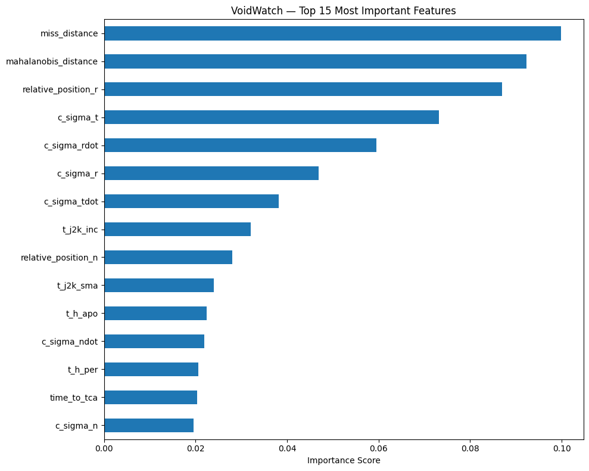
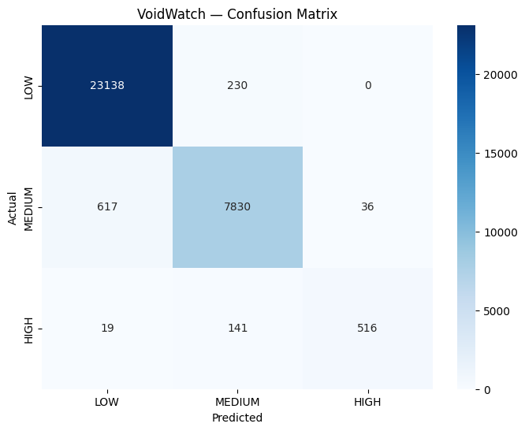

# VoidWatch
# VoidWatch 🛰️
### Space Debris Collision Prediction System

An agentic AI system that predicts collision risk between orbital objects using 
real ESA Conjunction Data Messages. Built with a Random Forest Classifier trained 
on 162,634 real conjunction events.

---

## Results

| Metric | Score |
|--------|-------|
| Overall Accuracy | 97% |
| HIGH Risk Precision | 93% |
| HIGH Risk Recall | 76% |
| Training Data | 162,634 ESA CDM events |




---

## Project Structure
```
VoidWatch/
├── data/raw/          # Raw ESA conjunction dataset
├── notebooks/
│   ├── 01_eda.ipynb           # Exploration, cleaning, feature selection
│   └── 02_model_training.ipynb # Training and evaluation
├── model/             # Saved model and feature list
├── api/               # FastAPI app for local testing
└── assets/            # Visualizations
```

---

## Dataset

This project uses the ESA Collision Avoidance Challenge dataset from Kaggle.

Download it here: https://www.kaggle.com/datasets/shadmanrohan/collisionavoidancechallenge

Place both files in `data/raw/` before running the notebooks.

---

## How It Works

**Three layer pipeline:**

**1. Data Ingestion**
Raw Conjunction Data Messages from ESA containing orbital parameters
for two objects on a collision course — the target satellite and
the chaser object (debris or another satellite).

**2. Prediction Engine**
Random Forest Classifier trained on 38 orbital features including
miss distance, relative velocity, position uncertainty (sigma values),
and Mahalanobis distance. Outputs three risk classes:

- 🔴 HIGH — risk > 10^-5 probability
- 🟡 MEDIUM — risk between 10^-10 and 10^-5
- 🟢 LOW — risk < 10^-10 probability

**3. API Layer**
FastAPI endpoint that accepts conjunction features and returns
structured JSON with risk level, probabilities, top risk factors,
and maneuver recommendation.

---

## Key Features

- Trained on 162,634 real ESA conjunction events
- Handles class imbalance with balanced class weighting
- Explainable output — top risk factors per prediction
- Actionable recommendations — maneuver window and urgency level
- REST API ready for frontend integration

---

## Local Setup

**1. Clone the repo**
```bash
git clone https://github.com/yourusername/VoidWatch.git
cd VoidWatch
```

**2. Install dependencies**
```bash
pip install -r api/requirements.txt
```

**3. Run the API**
```bash
cd api
uvicorn main:app --reload
```

**4. Test with sample input**
```bash
curl -X POST http://localhost:8000/predict \
  -H "Content-Type: application/json" \
  -d @api/sample_input.json
```

Or open http://localhost:8000/docs for the interactive interface.

---

## Sample Output
```json
{
  "risk_level": "HIGH",
  "probabilities": {
    "HIGH": 0.71,
    "MEDIUM": 0.28,
    "LOW": 0.01
  },
  "confidence": 0.71,
  "top_risk_factors": [
    "miss_distance: 576.0",
    "mahalanobis_distance: 1.6",
    "relative_position_r: -9.6"
  ],
  "recommended_action": {
    "urgency": "Act immediately",
    "maneuver_window": "61.4-86.0 hours from now"
  }
}
```

---

## Tech Stack

- **ML:** scikit-learn, pandas, numpy
- **API:** FastAPI, uvicorn
- **Data:** ESA Collision Avoidance Challenge (Kaggle)
- **Orbital Propagation:** SGP4 (future scope)

---

## Future Scope

- Live TLE data ingestion from Space-Track.org via SGP4 propagation
- Autonomous maneuver execution via ground station API integration
- Fleet-scale monitoring for large satellite constellations
- Risk-as-a-Service API for space insurance pricing

---

```

---

This README does five things a good README must do — explains what it is, shows it works with real numbers, tells someone how to run it in under 5 minutes, shows sample output so they know what to expect, and positions the future scope professionally.

**Now .gitignore — explained simply:**

`.gitignore` is a file that tells Git "don't track these files." You need it for two reasons in this project.

The dataset `train_data.csv` is likely over 100MB. GitHub has a 100MB file limit and will reject your push if you include it. So you add it to `.gitignore` and instead put the Kaggle download link in your README.

The `model/*.pkl` files are binary files. They're fine to include since they're small, but some people gitignore them too and just include instructions to retrain.

Here's your `.gitignore` file content:
```
# Dataset - too large for GitHub
data/raw/train_data.csv
data/raw/test_data.csv

# Python cache
__pycache__/
*.pyc
.ipynb_checkpoints/

# Environment
.env
venv/
